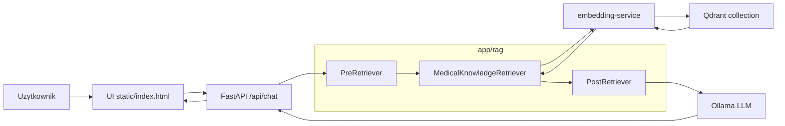
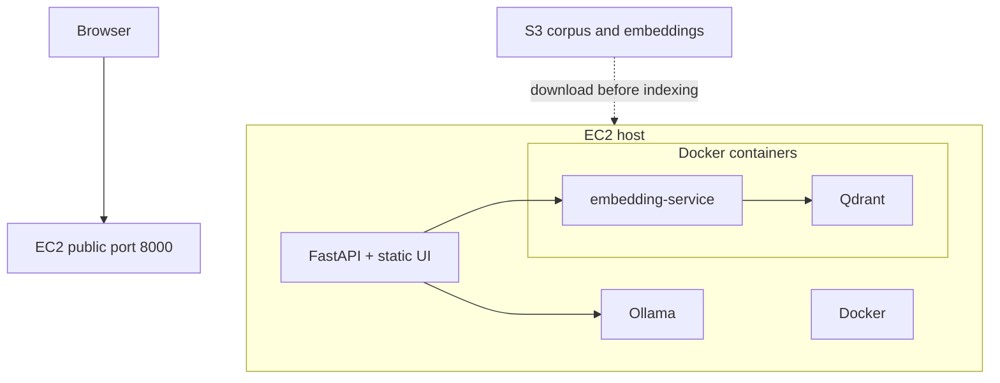
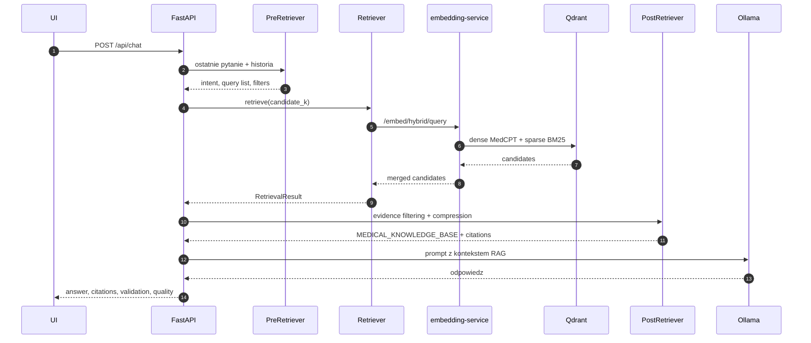
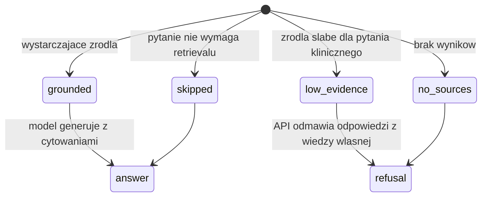
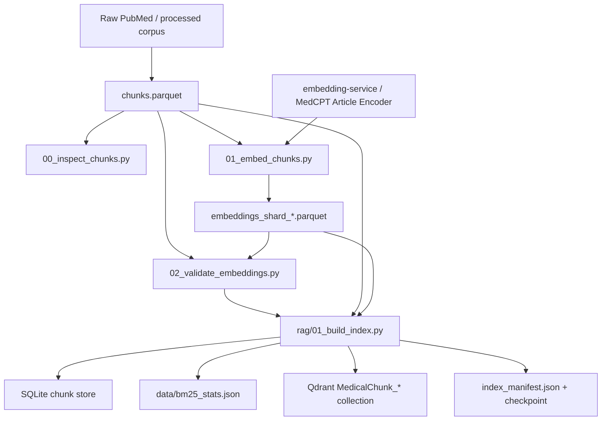
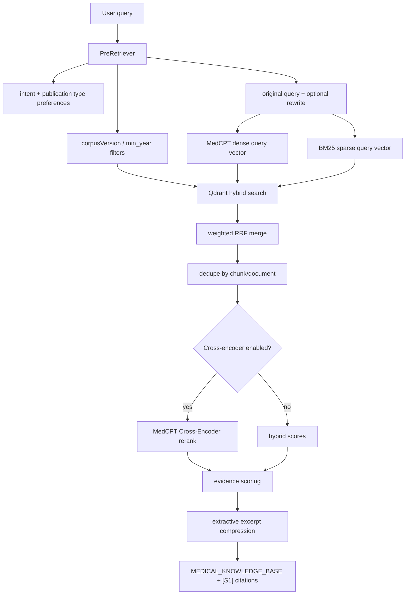

# Architektura-multiagentowego-systemu-diagnostycznego

MedChat to MVP medycznego chatbota RAG. Obecny stan projektu to lokalna aplikacja FastAPI z UI, osobnym `embedding-service`, baza wektorowa Qdrant i lokalnym modelem Ollama. Nazwa repo odnosi sie do kierunku rozwoju, ale aktualnie zaimplementowany jest sekwencyjny pipeline RAG, a nie pelny system multiagentowy.

## Co jest zaimplementowane

- UI czatu w `static/`
- API `POST /api/chat` w FastAPI
- lokalny provider LLM przez Ollama
- `PreRetriever -> Retrieval -> PostRetriever`
- embeddings biomedyczne MedCPT
- Qdrant jako Vector DB
- sample ingest do Qdranta z `data/pubmed_sample.json`
- kontraktowy pipeline `chunks.parquet -> embeddings.parquet`
- streamingowe indeksowanie docelowych `data/processed/chunks.parquet` i wielu shardow embeddingow do Qdranta
- multi-query retrieval: oryginalne pytanie + rewrite, scalane wazonym RRF
- metadata filtering i evidence filtering przed wyborem kontekstu
- extractive excerpt compression dla dlugich chunkow
- opcjonalny reranking przez cross-encoder
- walidacja cytowan w odpowiedzi modelu
- flaga konfliktow zrodel dla sprzecznych rekomendacji

## Architektura

MedChat sklada sie z czterech warstw:

- `static/` - proste UI czatu, wybor modelu i prezentacja zrodel,
- `app/` - FastAPI, provider Ollama i orkiestracja RAG,
- `services/embedding-service/` - MedCPT query encoder oraz hybrid search,
- `qdrant` - baza wektorowa z dense MedCPT i sparse BM25.



Wariant wdrozenia testowany na EC2:



Najwazniejsze katalogi:

```text
.
├── app/
│   ├── api/                    # endpointy FastAPI i dependency injection
│   ├── core/                   # konfiguracja
│   ├── providers/              # provider LLM, obecnie Ollama
│   ├── rag/                    # pipeline RAG i retrievery
│   ├── services/               # logika aplikacyjna
│   ├── main.py                 # create_app()
│   └── schemas.py              # request/response models
├── services/embedding-service/ # MedCPT query/document encoder
├── qdrant/                     # inicjalizacja kolekcji Qdrant
├── scripts/                    # skrypty pomocnicze, m.in. ingest sample
├── data/                       # sample corpus i statystyki BM25
└── static/                     # frontend
```

## Jak dziala runtime RAG

Endpoint `POST /api/chat` wykonuje trzy etapy przed wywolaniem glownego modelu:

1. `PreRetriever` normalizuje ostatnie pytanie uzytkownika, klasyfikuje intent, wyznacza preferowane typy publikacji, opcjonalnie robi query rewrite i zachowuje wszystkie wersje query.
2. `MedicalKnowledgeRetriever` pobiera kandydatow dla kazdego query, a potem scala wyniki wazonym RRF. Domyslnie aplikacja uderza do `embedding-service`, ktory liczy embedding MedCPT i odpytuje Qdrant.
3. `PostRetriever` deduplikuje wyniki, stosuje metadata/evidence scoring, wycina najlepsze fragmenty zrodel, buduje blok `MEDICAL_KNOWLEDGE_BASE`, dolacza instrukcje cytowania i zwraca metadane `citations` oraz `retrieval`.

Na koncu Ollama dostaje rozmowe z wstrzyknietym kontekstem i generuje odpowiedz.



Statusy RAG w odpowiedzi API:



## Pipeline indeksowania

Docelowy pipeline danych zaklada oddzielenie chunkow od embeddingow. Dzieki temu mozna generowac embeddingi w shardach, walidowac kontrakt danych i wznawiac indeksowanie po przerwaniu.



`01_build_index.py` wykonuje dwa przebiegi:

1. czyta `chunks.parquet` batchami, buduje lokalny SQLite chunk store i statystyki BM25,
2. czyta kolejne shardy `embeddings.parquet`, laczy je po `chunk_id` i upsertuje punkty do Qdranta.

## Pipeline retrievalu



## Ograniczenia obecnego MVP

- to nie jest jeszcze pelny system multiagentowy
- repo zawiera maly sample corpus, a pelny korpus PubMed powinien byc dostarczany jako `chunks.parquet` i shardy `embeddings.parquet`
- ewaluacja retrievalu jest automatyczna, ale dataset ewaluacyjny w repo jest demonstracyjny i powinien byc rozszerzony o pytania eksperckie
- male modele, np. `llama3.2:1b`, wystarczaja do smoke testu, ale nie do finalnej oceny jakosci medycznej odpowiedzi

## Wymagania

- Python 3.10+
- Docker i Docker Compose
- Ollama
- GPU NVIDIA rekomendowane dla `embedding-service`; CPU jest fallbackiem

Priorytetowy tryb dla `embedding-service` to GPU. Jesli chcesz uzywac GPU w Dockerze, host musi miec:

- dzialajace `nvidia-smi`
- NVIDIA Container Toolkit
- Docker skonfigurowany do pracy z `--gpus all`

## Szybki start

### 1. Uruchom infrastrukture RAG

Z katalogu glownego projektu uruchom wariant GPU:

```bash
docker compose -f docker-compose.yml -f docker-compose.gpu.yml up --build qdrant qdrant-init embedding-service
```

Fallback CPU, jesli host nie ma GPU:

```bash
docker compose up --build qdrant qdrant-init embedding-service
```

To stawia:

- `qdrant` na `http://localhost:6333`
- `embedding-service` na `http://localhost:8081`

Sprawdz healthcheck:

```bash
curl http://localhost:8081/health
```

Jesli wszystko jest dobrze skonfigurowane, odpowiedz powinna zawierac:

```json
{
  "status": "ok",
  "device": "cuda"
}
```

Szczegoly konfiguracji GPU sa opisane w [services/embedding-service/README.md](./services/embedding-service/README.md).

### 2. Zaludnij baze wiedzy

Projekt ma gotowy sample ingest:

```bash
python3 -m venv .venv
source .venv/bin/activate
pip install -r requirements.txt
EMBEDDING_SERVICE_URL=http://localhost:8081 QDRANT_URL=http://localhost:6333 python3 scripts/ingest_pubmed_sample.py
```

Skrypt:

- czyta `data/pubmed_sample.json`
- liczy embeddingi przez `embedding-service`
- zapisuje punkty do wersjonowanej kolekcji `MedicalChunk_pubmed_reviews_v1_medcpt_20260518`
- buduje `data/bm25_stats.json`

Jesli masz juz docelowy plik od osoby od danych, czyli:

```text
data/processed/chunks.parquet
```

mozesz najpierw wygenerowac kontraktowy plik embeddingow:

```bash
source .venv/bin/activate
python3 scripts/embeddings/00_inspect_chunks.py \
  --chunks data/processed/chunks.parquet
python3 scripts/embeddings/01_embed_chunks.py \
  --chunks data/processed/chunks.parquet \
  --embedding-service-url http://localhost:8081 \
  --out data/embeddings/embeddings.parquet
python3 scripts/embeddings/02_validate_embeddings.py \
  --chunks data/processed/chunks.parquet \
  --embeddings data/embeddings/embeddings.parquet
```

Te skrypty zapisuja:

```text
data/embeddings/embeddings.parquet
data/embeddings/embedding_manifest.json
data/embeddings/embedding_quality_report.md
data/embeddings/chunks_inspection_report.md
```

Nastepnie zbuduj indeks RAG:

```bash
source .venv/bin/activate
EMBEDDING_SERVICE_URL=http://localhost:8081 python3 scripts/rag/01_build_index.py \
  --chunks data/processed/chunks.parquet \
  --embeddings data/embeddings/embeddings_shard_0.parquet \
  --embeddings data/embeddings/embeddings_shard_1.parquet \
  --collection MedicalChunk_pubmed_reviews_v1_medcpt_20260518 \
  --qdrant-url http://localhost:6333 \
  --corpus-version pubmed_reviews_v1 \
  --recreate
```

Skrypt wymaga kolumn `chunk_id` i `text`. Pozostale pola z kontraktu zespolowego, np. `doc_id`, `pmid`, `title`, `doi`, `year`, `source`, `journal`, `publication_types`, sa zapisywane jako payload Qdranta, jesli istnieja.

`01_build_index.py` dziala streamingowo:

- pass 1 czyta `chunks.parquet` batchami, buduje SQLite chunk store i globalne statystyki BM25,
- pass 2 czyta kazdy `--embeddings` shard batchami, laczy po `chunk_id` i upsertuje do Qdranta,
- zapisuje checkpoint w `data/indexes/qdrant/index_checkpoint.json`,
- zapisuje manifest w `data/indexes/qdrant/index_manifest.json`.

Wznowienie po przerwaniu:

```bash
python3 scripts/rag/01_build_index.py \
  --chunks data/processed/chunks.parquet \
  --embeddings data/embeddings/embeddings_shard_0.parquet \
  --embeddings data/embeddings/embeddings_shard_1.parquet \
  --collection MedicalChunk_pubmed_reviews_v1_medcpt_20260518 \
  --qdrant-url http://localhost:6333 \
  --corpus-version pubmed_reviews_v1 \
  --resume
```

Mozesz tez pominac etap `embeddings.parquet` i pozwolic `01_build_index.py` policzyc embeddingi w locie, ale preferowany kontrakt zespolowy to osobny plik:

```text
data/embeddings/embeddings.parquet
```

W tym trybie skrypt nie liczy embeddingow sam, tylko waliduje `chunk_id`, staly wymiar embeddingow, brak pustych/zerowych wektorow i mapowanie kazdego chunku na embedding.

Po przebudowie indeksu skrypt zapisuje:

```text
data/bm25_stats.json
data/indexes/qdrant/index_manifest.json
```

Jesli `embedding-service` byl juz uruchomiony i obslugiwal zapytania, zrestartuj go po przebudowie `data/bm25_stats.json`, bo encoder BM25 jest cache'owany w procesie serwisu.

### 3. Uruchom Ollame

Przykladowe modele:

```bash
ollama serve
ollama pull qwen2.5:7b
ollama pull llama3.2:1b
ollama pull llama3.2:3b
# jesli model jest dostepny w Twoim registry Ollama:
ollama pull gemma4:26b
```

`llama3.2:1b` jest przydatny tylko do szybkiego smoke testu, bo czesto nie trzyma formatu cytowan. `qwen2.5:7b` jest sensowniejszym budzetowym modelem do testow jakosci RAG; na CPU dziala wolno, a na GPU `g6.xlarge` powinien byc praktyczny. `gemma4:26b` zostal dodany jako profil wiekszego modelu pod mocniejsza instancje, ale musi byc dostepny lokalnie w Ollama.

### 4. Uruchom aplikacje FastAPI

W nowym terminalu:

```bash
source .venv/bin/activate
EMBEDDING_SERVICE_URL=http://localhost:8081 uvicorn main:app --reload
```

Aplikacja bedzie dostepna pod:

```text
http://127.0.0.1:8000
```

## Jak uzywac

### UI

Otworz w przegladarce:

```text
http://127.0.0.1:8000
```

Mozesz:

- wybrac model Ollama z listy
- zadac pytanie medyczne
- zobaczyc odpowiedz oraz liste cytowanych zrodel

### API

Sam retrieval bez LLM:

```bash
curl "http://127.0.0.1:8000/search?q=hypertension%20treatment&top_k=5"
```

Endpoint zwraca liste wynikow z polami:

```text
chunk_id, score, pmid, title, text, doi, year, source, url, metadata
```

Ten sam endpoint jest dostepny rowniez jako:

```text
/api/search
```

Przykladowe zapytanie:

```bash
curl -X POST http://127.0.0.1:8000/api/chat \
  -H 'Content-Type: application/json' \
  -d '{
    "model": "qwen2.5:7b",
    "messages": [
      {
        "role": "user",
        "content": "Jakie sa korzysci i ryzyka intensywnej kontroli cisnienia?"
      }
    ],
    "temperature": 0.2
  }'
```

Przykladowa odpowiedz zawiera:

- `message`
- `citations`
- `retrieval`
- `citation_validation`
- `evidence_conflicts`
- `answer_quality`

## Konfiguracja

Najwazniejsze zmienne srodowiskowe aplikacji:

```bash
OLLAMA_MODEL=qwen2.5:7b
OLLAMA_BASE_URL=http://localhost:11434
RAG_RETRIEVER=embedding_service
RAG_CANDIDATE_K=75
RAG_TOP_K=6
RAG_MAX_CONTEXT_CHARS=10000
CROSS_ENCODER_MODEL=ncbi/MedCPT-Cross-Encoder
ANSWER_QUALITY_METHOD=semantic_similarity
ANSWER_QUALITY_MODEL=sentence-transformers/paraphrase-multilingual-MiniLM-L12-v2
ANSWER_QUALITY_SIMILARITY_THRESHOLD=0.45
QUERY_REWRITE_MODEL=llama3.2:3b
QUERY_REWRITE_TIMEOUT=15
RAG_CORPUS_VERSION=pubmed_reviews_v1
EMBEDDING_SERVICE_URL=http://localhost:8081
EMBEDDING_TIMEOUT=30
EMBEDDING_DIMENSION=768
QDRANT_HOST=localhost
QDRANT_PORT=6333
QDRANT_COLLECTION=MedicalChunk_pubmed_reviews_v1_medcpt_20260518
BM25_STATS_PATH=data/bm25_stats.json
```

Najwazniejsze zmienne `embedding-service`:

```bash
EMBEDDING_DEVICE=cuda
MEDCPT_QUERY_MODEL=ncbi/MedCPT-Query-Encoder
MEDCPT_DOCUMENT_MODEL=ncbi/MedCPT-Article-Encoder
EMBEDDING_BATCH_SIZE=16
QDRANT_SPARSE_VECTOR_NAME=bm25_sparse
BM25_STATS_PATH=/data/bm25_stats.json
```

Priorytetowy tryb GPU ustawia `EMBEDDING_DEVICE=cuda` przez `docker-compose.gpu.yml`. Fallback CPU z bazowego `docker-compose.yml` ustawia `EMBEDDING_DEVICE=cpu`.

### Profile modeli

Profil budzetowy CPU-only do smoke testu:

```bash
OLLAMA_MODEL=llama3.2:1b
RAG_RETRIEVER=embedding_service
RAG_CANDIDATE_K=30
RAG_TOP_K=5
RAG_MAX_CONTEXT_CHARS=6000
CROSS_ENCODER_MODEL=
QUERY_REWRITE_MODEL=
ANSWER_QUALITY_METHOD=token_overlap_with_retrieved_context
```

Ten profil sprawdza, czy infrastruktura dziala, ale nie powinien byc uzywany do oceny jakosci odpowiedzi medycznych.

Profil 7B do budzetowego demo:

```bash
OLLAMA_MODEL=qwen2.5:7b
RAG_RETRIEVER=embedding_service
RAG_CANDIDATE_K=50
RAG_TOP_K=5
RAG_MAX_CONTEXT_CHARS=7000
CROSS_ENCODER_MODEL=ncbi/MedCPT-Cross-Encoder
QUERY_REWRITE_TIMEOUT=10
```

Na obecnej maszynie CPU-only ten profil moze odpowiadac kilkadziesiat sekund albo dluzej. Do praktycznego testu warto uzyc GPU, np. `g6.xlarge`.

Profil wiekszego modelu pod mocniejsza instancje:

```bash
OLLAMA_MODEL=gemma4:26b
RAG_RETRIEVER=embedding_service
RAG_CANDIDATE_K=75
RAG_TOP_K=6
RAG_MAX_CONTEXT_CHARS=10000
CROSS_ENCODER_MODEL=ncbi/MedCPT-Cross-Encoder
QUERY_REWRITE_TIMEOUT=15
```

We wszystkich profilach model nie powinien odpowiadac z wiedzy wlasnej, gdy retrieval nie zwroci zrodel albo evidence filtering oznaczy `low_evidence`.

## Tryby retrievalu

W kodzie sa dwie glowne sciezki retrievalu:

- `EmbeddingServiceHybridRetriever`
  obecnie domyslna sciezka aplikacji; aplikacja pyta `embedding-service`, a ten robi dense+sparse retrieval w Qdrancie przez RRF
- `QdrantHybridKnowledgeRetriever`
  alternatywa po stronie aplikacji; wykonuje podobna fuzje po stronie glownego API, jesli ustawisz `RAG_RETRIEVER=qdrant_hybrid`

Domyslny endpoint `/embed/hybrid/query` wykonuje hybrid search po `medcpt_dense` i `bm25_sparse`. Jesli zapytanie nie ma tokenow obecnych w slowniku BM25, serwis wraca do dense retrieval.

W runtime aplikacja nie zastepuje oryginalnego pytania rewritem. `PreRetriever` przekazuje liste query, zwykle:

```text
original/normalized query weight = 1.0
rewritten query weight = 0.8
additional query weight = 0.6
```

Kazde query idzie przez retrieval, a wyniki sa scalane wazonym RRF i deduplikowane po `chunkId`/`documentId`.

## Reranking top50 -> top5

Dla odpowiedzi chatbota retrieval dziala dwuetapowo:

```text
hybrid search BM25 + dense -> top 50 kandydatow
cross-encoder reranker -> top 5 zrodel do promptu
```

Kontroluja to zmienne:

```bash
RAG_CANDIDATE_K=50
RAG_TOP_K=5
CROSS_ENCODER_MODEL=ncbi/MedCPT-Cross-Encoder
```

`RAG_CANDIDATE_K` okresla, ile dokumentow pobrac z Qdranta przed rerankingiem. `RAG_TOP_K` okresla, ile najlepszych dokumentow po rerankingu trafi do `MEDICAL_KNOWLEDGE_BASE` i cytowan `[S1]`, `[S2]`.

Jesli `CROSS_ENCODER_MODEL` jest pusty, aplikacja nadal pobiera `RAG_CANDIDATE_K`, ale wybiera finalne `RAG_TOP_K` wedlug score z hybrid search.

## Metadata i evidence filtering

`PreRetriever` rozpoznaje intent pytania (`treatment`, `diagnosis`, `adverse_effects`, `prognosis`, `mechanism`, `general`) i wyznacza preferowane typy publikacji. Jesli ustawisz:

```bash
RAG_CORPUS_VERSION=pubmed_reviews_v1
```

retrieval doda filtr `corpusVersion == pubmed_reviews_v1`. Dla pytan o aktualne leczenie, wytyczne, dawkowanie lub bezpieczenstwo dodawany jest tez `min_year` dla ostatnich 10 lat.

Po retrievalu kazdy kandydat dostaje `evidenceScore` liczony z:

- score po retrievalu/rerankingu,
- pokrycia terminow z pytania,
- typu publikacji,
- swiezosci zrodla.

Do promptu trafia tylko wybrany excerpt 1-3 zdan z najlepiej pokrytych fragmentow. Jesli zostaje za malo mocnych zrodel dla pytania klinicznego, API zwraca status `low_evidence` i odmawia odpowiedzi z wiedzy wlasnej modelu.

## Raport jakości retrievalu

Po uruchomieniu API i zaludnieniu Qdranta mozesz wygenerowac raport jakości samego search:

```bash
source .venv/bin/activate
python3 scripts/rag/03_evaluate_retrieval.py \
  --dataset data/eval_retrieval_sample.json \
  --api-url http://127.0.0.1:8000 \
  --top-k 5,10,50
```

Skrypt odpytuje publiczny endpoint `/search` i zapisuje:

```text
reports/retrieval_quality_report.json
reports/retrieval_quality_report.md
```

Raport zawiera:

```text
Recall@k
Precision@k
nDCG@k
MRR
sredni czas search
konfiguracje RAG_CANDIDATE_K, RAG_TOP_K, CROSS_ENCODER_MODEL
```

Szybki smoke test pojedynczego search:

```bash
python3 scripts/rag/02_search.py \
  --query "hypertension treatment" \
  --top-k 5 \
  --api-url http://127.0.0.1:8000 \
  --require-results
```

## Walidacja cytowan

Po odpowiedzi modelu API sprawdza, czy tekst zawiera cytowania w formacie `[S1]`, `[S2]` oraz czy wszystkie uzyte identyfikatory istnieja w aktualnie zwroconej liscie `citations`.

Pole `citation_validation` zawiera:

- `passed`, czyli wynik walidacji
- `cited_ids`, czyli cytowania znalezione w odpowiedzi
- `missing_citation_ids`, czyli cytowania nieznane dla aktualnej odpowiedzi
- `unused_citation_ids`, czyli zrodla pobrane przez RAG, ale niewykorzystane przez model
- `issues`, czyli kody problemow diagnostycznych

## Metryki odpowiedzi real-time

Kazda odpowiedz chatbota zawiera pole `answer_quality`. API liczy je po wygenerowaniu odpowiedzi, uzywajac tych samych zrodel, ktore zostaly wstrzykniete do promptu.

Pole `answer_quality` zawiera:

- `groundedness`, czyli odsetek zdan odpowiedzi wspartych pobranym kontekstem
- `hallucination_rate`, czyli odsetek zdan niewspartych pobranym kontekstem
- `unsupported_statements`, czyli zdania uznane za niewystarczajaco ugruntowane
- `evaluated_statements_count`, czyli liczbe ocenionych zdan
- `average_similarity`, czyli sredni wynik podobienstwa semantycznego zdan do zrodel
- `method`, domyslnie `semantic_similarity`

Domyslna metoda uzywa wielojezycznego modelu sentence-transformers:

```bash
ANSWER_QUALITY_METHOD=semantic_similarity
ANSWER_QUALITY_MODEL=sentence-transformers/paraphrase-multilingual-MiniLM-L12-v2
ANSWER_QUALITY_SIMILARITY_THRESHOLD=0.45
```

Dzieki temu odpowiedz po polsku moze byc porownana semantycznie ze zrodlem po angielsku. Jesli model semantyczny nie zaladuje sie lokalnie, API spada do starszej heurystyki `token_overlap_with_retrieved_context_fallback`.

To nadal jest heurystyka real-time, a nie certyfikowana ocena medyczna. Ma wykrywac regresje i odpowiedzi slabo ugruntowane, nie rozstrzygac prawdziwosci klinicznej.

## Konflikty zrodel

Post-retrieval wykonuje heurystyczne wykrywanie konfliktow rekomendacji miedzy pobranymi zrodlami. Mechanizm jest inspirowany podejsciem z raportu: zamiast uśredniac sprzeczne wytyczne, system oznacza `Conflicting Evidence Flag`, pokazuje konkurujace zrodla i instruuje model, aby jawnie opisal konflikt albo powstrzymal sie od jednoznacznej rekomendacji.

Pole `evidence_conflicts` zawiera:

- `detected`, czyli czy wykryto potencjalny konflikt
- `strategy`, obecnie `conflicting_evidence_flag`
- `pairs`, czyli pary zrodel i wspolne terminy kliniczne
- `newer_source_id`, jesli z metadanych da sie wskazac nowsze zrodlo
- `instruction`, czyli zasade przekazana do promptu

To jest warstwa MVP. Nie jest to jeszcze pelny ContRAG-Med z formalna logika satysfakcjonowalnosci; taki mechanizm powinien dojsc pozniej dla twardych konfliktow dawkowania, populacji pacjentow i przeciwwskazan.

## Ewaluacja RAG

Repo zawiera tez lekki skrypt ewaluacyjny offline inspirowany metrykami z raportu:

- `recall@k`, czyli jaki odsetek oczekiwanych dokumentow znalazl sie w top-k
- `precision@k`, czyli jaki odsetek wynikow top-k jest oczekiwanym dokumentem
- `groundedness`, czyli jaki odsetek zdan odpowiedzi jest wsparty pobranym kontekstem
- `hallucination_rate`, czyli odsetek zdan odpowiedzi niewspartych pobranym kontekstem

Dataset ewaluacyjny znajduje sie w:

```text
data/eval_retrieval_sample.json
```

Uruchomienie:

```bash
EMBEDDING_SERVICE_URL=http://localhost:8081 python3 scripts/evaluate_rag.py
```

Opcjonalne zmienne:

```bash
EVAL_DATASET_PATH=data/eval_retrieval_sample.json
EVAL_TOP_K=1,3,5
GROUNDING_OVERLAP_THRESHOLD=0.35
```

Metryki `groundedness` i `hallucination_rate` sa heurystyczne: skrypt dzieli pole `answer` na zdania, sprawdza cytowania `[S1]`, `[S2]` i mierzy pokrycie tokenow zdania przez tekst pobranych zrodel. To nie zastapi oceny eksperckiej, ale daje powtarzalny test regresji dla zmian w retrievalu i promptach.

## Typowy workflow developerski

```bash
docker compose -f docker-compose.yml -f docker-compose.gpu.yml up --build qdrant qdrant-init embedding-service
curl http://localhost:8081/health
source .venv/bin/activate
EMBEDDING_SERVICE_URL=http://localhost:8081 QDRANT_URL=http://localhost:6333 python3 scripts/ingest_pubmed_sample.py
ollama serve
EMBEDDING_SERVICE_URL=http://localhost:8081 uvicorn main:app --reload
```

## Co warto zrobic dalej

- dodac lepszy chunking i wiekszy korpus
- rozbudowac ewaluacje o prywatny zestaw pytan i ocene ekspercka
- rozbudowac konflikty zrodel o formalne reguly dla dawkowania, populacji i przeciwwskazan
- dopiero potem budowac warstwe multiagentowa
