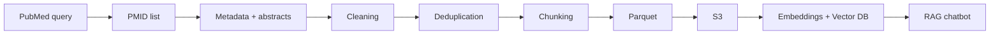

# Project Scope: PubMed Data Pipeline

## Cel

Celem tej części projektu było przygotowanie danych PubMed do medycznego chatbota LLM + RAG.

Zakres danych:

```text
PubMed abstracts
ostatnie 5 lat
review publications
systematic reviews
English
has abstract
not retracted
```

Dataset:

```text
pubmed_reviews_v1
```

## Pipeline



## Wynik

W finalnym przebiegu pipeline przygotowano:

```text
PMIDs: 990,391
metadata rows: 982,019
documents: 977,777
chunks: 977,777
```

Różnica między PMID count a metadata rows wynika z rekordów, których PubMed EFetch nie zwrócił jako klasyczne rekordy `PubmedArticle` w czasie pobierania. Pipeline to raportuje i przechodzi dalej, bo strata była mała względem całego zbioru.

## Dlaczego `1 abstract = 1 chunk`

Na MVP przyjęto prostą i przewidywalną regułę: jeden abstrakt PubMed staje się jednym chunkiem. To ułatwia embeddingi, cytowania i walidację, bo każdy chunk zachowuje bezpośrednie powiązanie z PMID.

