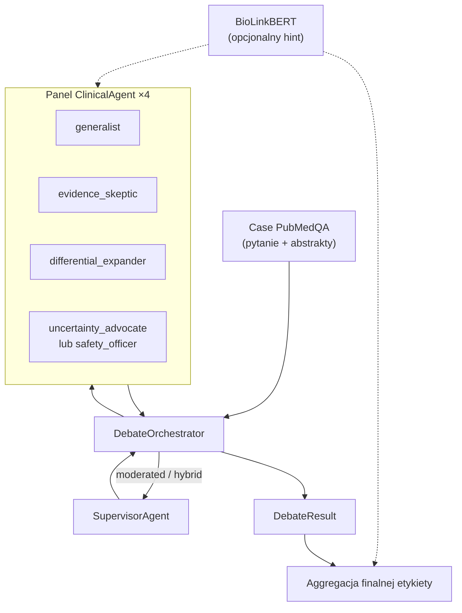
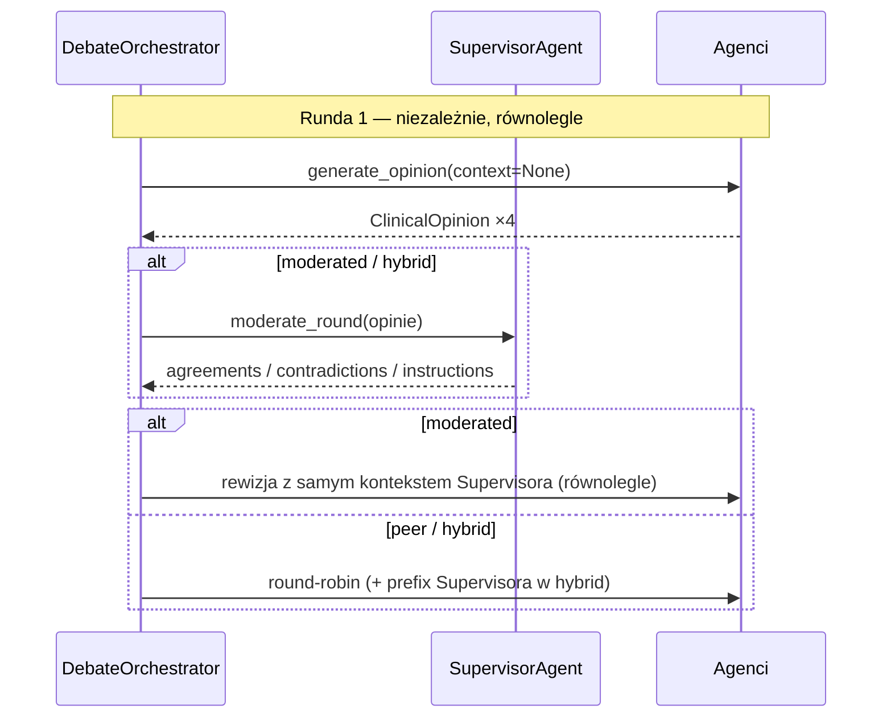
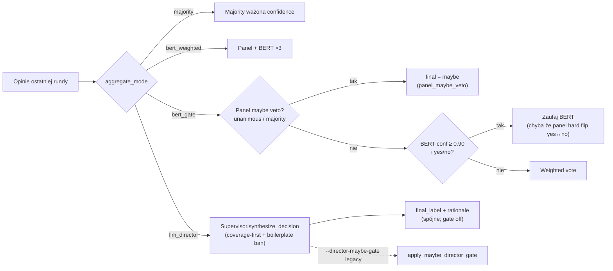

# Architektura dyskusji agentów i Supervisora

Stan na: 2026-08-06  
Kod: `app/agents/`

Dokument opisuje **aktualne** działanie panelu multi-agentowego (debaty klinicznej / PubMedQA) oraz rolę Supervisora — na podstawie implementacji, nie założeń projektowych.

---

## 1. Przegląd

System to **wielorundowa debata 4 agentów** (inspiracja MedAgents / MAC / MedARC), orkiestrowana przez `DebateOrchestrator`. Supervisor jest opcjonalnym moderatorem rund i opcjonalnym „Directorem” przy finalnej decyzji.

**Ważne ograniczenie zakresu:** pętla debaty **nie woła Qdrant/RAG**. Evidencja pochodzi z case’a PubMedQA (pytanie + abstrakty z korpusu). BioLinkBERT jest używany wyłącznie jako **hint / głos klasyfikatora**, nie jako retrieval.



---

## 2. Kluczowe pliki

| Plik | Rola |
|------|------|
| `app/agents/orchestrator.py` | Pętla rund, tryby debaty, early-exit, adaptive rounds |
| `app/agents/supervisor_agent.py` | Moderator rund + Director (synteza decyzji) |
| `app/agents/agent.py` | Pojedynczy `ClinicalAgent` → `ClinicalOpinion` (JSON) |
| `app/agents/prompts.py` | Prompti person, Supervisora, budowa wiadomości |
| `app/agents/models.py` | Schematy Pydantic (opinie, moderacja, director, wynik) |
| `app/agents/aggregation.py` | Majority / BERT-gate / LLM Director + maybe-gate |
| `app/agents/backends.py` | Ollama / Mock, BioLinkBERT hint |
| `app/agents/uncertainty.py` | Sygnały niepewności, routing do `maybe` |
| `app/agents/heuristics.py` | Frazy „inconclusive” w abstrakcie |
| `scripts/agents/evaluate_debate_pubmedqa.py` | CLI ewaluacji |

---

## 3. Panel agentów

### 3.1 Tryb kliniczny (`DEFAULT_PERSONAS`)

1. `generalist`
2. `evidence_skeptic`
3. `differential_expander`
4. `safety_officer` — audyt bezpieczeństwa; critical red flag domyślnie **hard halt** (patrz `--safety-red-flag`)

### 3.2 Tryb PubMedQA (`PUBMEDQA_PERSONAS`, używany w ewaluacji)

1. **`generalist`** → *AuthorConclusionReader* — czyta wniosek autorów (yes/no/maybe)
2. **`evidence_skeptic`** — krytyka metodologii; nie powinien defaultować do `maybe`
3. **`differential_expander`** — argumentuje hipotezę przeciwną
4. **`uncertainty_advocate`** → *UncertaintyAuditor* — broni niepełnego pokrycia pytania / etykiety `maybe`

Agenci dzielą jeden `InferenceBackend` (opcjonalnie osobny backend dla Supervisora). Każda wypowiedź to ustrukturyzowany `ClinicalOpinion`; przy błędzie parsowania — fallback z niską pewnością (`sources_used=["fallback"]`).

### 3.3 Blind critic

`uncertainty_advocate` może być trzymany bez hintu BioLinkBERT (parametr `blind_critic` / CLI `--blind-critic`):

| Wartość | Zachowanie |
|---------|------------|
| `all-rounds` (**domyślne**) | bez hintu w **wszystkich** rundach — strażnik niepewności bez authority bias BERT |
| `r1-only` | legacy: blind tylko w rundzie 1, od R2 hint wraca |
| `off` | hint od rundy 1 |

---

## 4. Przepływ dyskusji

### 4.1 Setup (ścieżka ewaluacji)

1. Załaduj case PubMedQA + abstrakty.
2. Opcjonalnie uruchom BioLinkBERT → `EvidenceHint`.
3. Zbuduj 4 agentów (`task_mode="pubmedqa"`) + `DebateOrchestrator`.
4. Sformatuj case jako bloki `RESEARCH QUESTION` + `EVIDENCE`.

### 4.2 Runda 1 — niezależne opinie

- Wszyscy agenci mówią **równolegle** (semafory `agent_concurrency`).
- Brak kontekstu peerów (`context=None`).
- Blind critic: advocate bez hintu BERT (domyślnie we wszystkich rundach; `--blind-critic`).

### 4.3 Rundy 2…N — zależnie od `debate_mode`

| Tryb | Architektura (string) | Zachowanie |
|------|----------------------|------------|
| **`moderated`** (domyślny) | `supervised_moderation` | Supervisor moderuje poprzednią rundę → wszyscy rewidują **równolegle**, widząc tylko kontekst Supervisora |
| **`peer`** | `peer_round_robin` | Bez Supervisora; agenci mówią **sekwencyjnie**; każdy widzi peerów z poprzedniej rundy + tych, którzy już mówili w tej rundzie |
| **`hybrid`** | `hybrid_supervised_peer` | Supervisor moderuje, potem round-robin peer + prefix instrukcji Supervisora |

### 4.4 Warunki stopu (po każdej rundzie)

1. Osiągnięto `max_rounds` → stop.
2. Opcjonalny callback `early_exit` (np. `check_early_exit_asymmetric_veto`) → stop.
3. Przy `adaptive_rounds=True` i `round >= min_rounds`: jeśli `should_continue_debate(...)` jest fałszywe → stop.

Wynik: `DebateResult` (historia rund, `final_opinions`, lista moderacji, `shared_report`).

---

## 5. Komunikacja między agentami

Komunikacja to **wstrzykiwanie do promptu**. Domyślnie (`--peer-context nl`) opinie peerów i moderacja Supervisora są **zwięzłymi streszczeniami NL**, nie surowym JSON:

```
[R1] generalist (conf=0.80, conclusive): yes
  Pro: …
  Con: …
```

| `--peer-context` | Zachowanie |
|------------------|------------|
| `nl` (**domyślne**) | natural language |
| `compact-json` | skrócony JSON (dawne pubmedqa) |
| `full-json` | pełny `model_dump` |

Kolejność mówienia w round-robin = kolejność listy z `build_default_agents`.



---

## 6. Supervisor — jak działa

Klasa: `SupervisorAgent` (`app/agents/supervisor_agent.py`).  
Temperatura: **0.2** (retry naprawy JSON: **0.0**).

Supervisor ma **dwie role LLM** (ta sama klasa, różne prompti).

### 6.A Moderator (`moderate_round`) — między rundami

**Kiedy:** tryby `moderated` i `hybrid`, przed rundą ≥ 2.

**Wejście:** case pacjenta/pytania + JSON opinii poprzedniej rundy.

**Wyjście (`SupervisorModerationOutput`):**

| Pole | Znaczenie |
|------|-----------|
| `primary_endpoint_result` | Co pokazał primary endpoint (1–2 zdania z abstraktu) |
| `author_conclusion` | `yes` / `no` / `maybe` / `unclear` |
| `residual_uncertainty` | Lista nierozstrzygniętych kwestii |
| `agreements` | Zgodności oparte na evidencji |
| `contradictions` | Sprzeczności między agentami / evidencją |
| `round_instructions` | Konkretne wymagania na następną rundę |

**Użycie w orkiestratorze:**

- kontekst promptów agentów w kolejnej rundzie,
- sygnał do `should_continue_debate` (sprzeczności / ≥2 residual uncertainty),
- budowa `shared_report` w `DebateResult`.

**Fail Supervisora (`supervisor_fail` / `--supervisor-fail`):** po wyczerpaniu retry (T=0), gdy JSON moderacji jest nieparsowalny:

| Wartość | Zachowanie |
|---------|------------|
| `peer-round` (**domyślne**) | Ta runda → peer round-robin **bez** pustego fallbacku; kolejne rundy znów próbują Supervisora |
| `peer-rest` | Jak wyżej + peer do końca case’a |
| `empty-defer` | Legacy: pusty fallback (`unclear` / re-run) wstrzyknięty do moderated/hybrid |

**Overlay bezpieczeństwa (`safety_red_flag` / CLI `--safety-red-flag`):**

| Wartość | Zachowanie |
|---------|------------|
| `halt` (**domyślne**) | Po critical red flag (`safety_passed=False` + `immediate_intervention_required=True`) debata **kończy się natychmiast**; `DebateResult.safety_halted=True` |
| `escalate-label` | Jak `halt` + w ewaluacji wymuszony `predicted=maybe`, `rule=safety_escalation`, `consensus_type=escalation` |
| `defer` | Legacy: `RED FLAG DETECTED` trafia do `round_instructions` **następnej** rundy |

**Fallback przy złym JSON:** puste agreements/contradictions, instrukcja „re-run moderation”, `author_conclusion="unclear"`.

### 6.B Director (`synthesize_decision`) — finalna synteza

**Kiedy:** agregacja z `--aggregate-mode llm_director`.

**Wejście:**

- `patient_case` (abstrakt = ground truth),
- `shared_report` z ostatniej moderacji,
- kompaktowy `debate_brief` (nie pełny transcript),
- hint BioLinkBERT (krytycznie, bez rubber-stamp).

**Wyjście (`SupervisorDirectorOutput`):**

- `final_label`: yes / no / maybe  
- `consensus_type`: consensus / differential / escalation  
- checklista maybe: `primary_endpoint_answers_question`, `findings_decisive_for_question`, `authors_state_uncertainty`  
- `question_coverage`: full / partial / none  

Po odpowiedzi LLM **domyślnie nie ma** post-hoc nadpisania etykiety (`--director-maybe-gate off`). Prompt Directora: **QUESTION COVERAGE FIRST** + ban na boilerplate `maybe`, z przywróconym `maybe` przy mixed/partial coverage i gdy pytanie ≠ primary endpoint. Ablacja: `--director-maybe-gate legacy`.

**Fallback:** `final_label="maybe"`, `consensus_type="escalation"`.

---

## 7. Adaptive rounds i early-exit

### `should_continue_debate` → True = kontynuuj

- moderator zgłosił `contradictions`, lub  
- ≥ 2 elementy w `residual_uncertainty`, lub  
- panel nie jest jednogłośny, lub  
- entropia etykiet > `conflict_entropy_threshold` (domyślnie **0.35**)

### `check_early_exit_asymmetric_veto` → True = zakończ wcześniej

Tylko gdy:

1. panel jednogłośnie **yes** lub **no**, oraz  
2. `uncertainty_advocate` **nie** głosuje `maybe` i ma confidence ≥ **0.65**, oraz  
3. abstrakt nie pasuje do fraz „inconclusive”, oraz  
4. nie ma silnej większości oznaczeń `evidence_conclusiveness=inconclusive`.

BioLinkBERT **nie** wpływa na early-exit.

---

## 8. Agregacja finalnej etykiety

Po debacie (poza orkiestratorem) wybierany jest tryb:



Dodatkowo możliwe:

- `build_consensus_decision` → consensus / differential / escalation (bez Directora),
- evidence audit, uncertainty routing do `maybe`.

**`bert_gate` + panel maybe veto** (parametr `panel_maybe_veto`, CLI `--panel-maybe-veto`):

| Wartość | Zachowanie |
|---------|------------|
| `unanimous` (**domyślne**) | Wszystkie ważne głosy panelu = `maybe` → absolutne weto nad BERT (`panel_maybe_veto`) |
| `majority` | Share `maybe` > 0.5 (≥3/4) → to samo weto |
| `off` | Legacy: panel `maybe` nie wetuje wysokoconfidence BERT yes/no |

Override hard flip (jednogłośny panel yes↔no ≠ BERT) nadal działa niezależnie od weta `maybe`.

---

## 9. Konfiguracja (istotne knoby)

### Orchestrator

| Parametr | Domyślnie / zakres |
|----------|-------------------|
| `rounds` / `min_rounds` / `max_rounds` | 2–5 |
| `debate_mode` | `moderated` \| `peer` \| `hybrid` |
| `blind_critic` | `all-rounds` \| `r1-only` \| `off` (domyślnie `all-rounds`) |
| `safety_red_flag` | `halt` \| `escalate-label` \| `defer` (domyślnie `halt`) |
| `peer_context` | `nl` \| `compact-json` \| `full-json` (domyślnie `nl`) |
| `supervisor_fail` | `peer-round` \| `peer-rest` \| `empty-defer` (domyślnie `peer-round`) |
| `adaptive_rounds` | `False` |
| `conflict_entropy_threshold` | `0.35` |
| `agent_concurrency` | `4` (w eval często `1`) |
| `supervisor_backend` | opcjonalnie osobny model |

### Eval CLI (`evaluate_debate_pubmedqa.py`)

- `--rounds 3`, `--debate-mode moderated`, `--aggregate-mode bert_gate`
- `--bert-gate-confidence 0.90`, `--bert-vote-weight 3.0`
- `--panel-maybe-veto unanimous|majority|off` (domyślnie `unanimous`)
- `--director-maybe-gate off|legacy` (domyślnie `off` — reguły w prompcie Directora)
- `--blind-critic all-rounds|r1-only|off` (domyślnie `all-rounds`)
- `--safety-red-flag halt|escalate-label|defer` (domyślnie `halt`)
- `--peer-context nl|compact-json|full-json` (domyślnie `nl`)
- `--supervisor-fail peer-round|peer-rest|empty-defer` (domyślnie `peer-round`)
- `--hint none|biolinkbert`
- `--supervisor-model` (cięższy model na moderatora/directora)
- `--uncertainty-route`, `--fast` / `--compact`

### Temperatury

- Agenci kliniczni: **0.3** (repair: **0.0**)
- Supervisor: **0.2** (repair: **0.0**)

---

## 10. Relacja do RAG

| Komponent | W debacie? |
|-----------|------------|
| Qdrant / retrieval | **Nie** |
| Abstrakty PubMedQA z korpusu | **Tak** (input case) |
| BioLinkBERT (`EvidenceClassifier`) | Hint / głos / wejście Directora |
| FastAPI chat RAG | Osobna ścieżka aplikacji |

---

## 11. Szybkie podsumowanie

1. **Runda 1:** 4 niezależne opinie (równolegle); advocate bez BERT (domyślnie też w kolejnych rundach).  
2. **Rundy 2+:** supervisor (moderated/hybrid) i/lub peer round-robin.  
3. **Supervisor jako Moderator:** shared report + instrukcje między rundami.  
4. **Supervisor jako Director:** przy `llm_director` — coverage-first + boilerplate ban (bez absolutnego MUST yes/no); post-hoc gate tylko z `--director-maybe-gate legacy`.  
5. **Bez Supervisora w decyzji:** majority / bert_weighted / bert_gate.  
6. Early-exit i adaptive rounds skracają debatę przy zgodzie / braku konfliktu.

Główny entrypoint ewaluacji: `scripts/agents/evaluate_debate_pubmedqa.py`.  
Demo offline: `python -m app.agents`.
